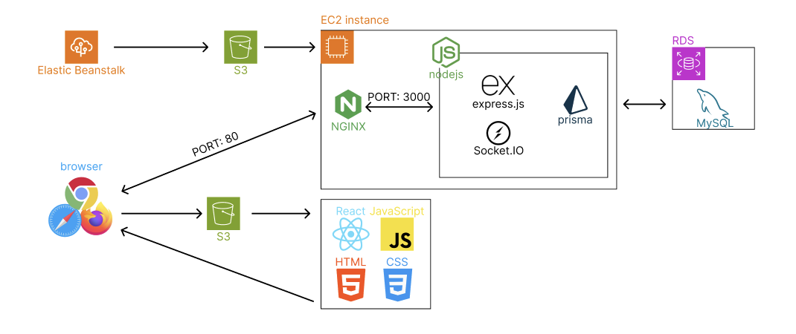
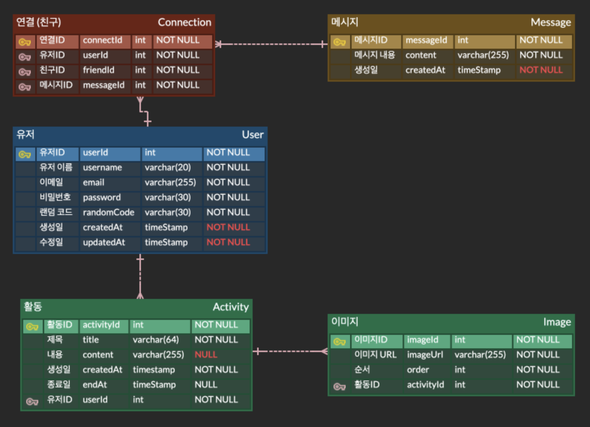

### 모해

#### 역할

- 기획자: G0MTENG
- 프론트엔드 개발자: G0MTENG
- 백엔드 개발자: G0MTENG
- 디자이너: G0MTENG

#### 설명

> 저희는 친구들과 자주 “뭐해?”라고 묻곤 합니다.
> “지금 하고 있는 일을 간단히 공유하고, 한눈에 볼 수 있는 서비스가 있으면 재밌지 않을까?”라는 아이디어에서
> 이번 프로젝트를 시작하게 됐습니다.
> 이렇게 탄생한 ‘모해’는 쉽고 빠르게 일상을 공유하고, 대화하고, 다른 사람들의 근황을 한눈에 확인할 수 있는 SNS입니다.

#### 기술 스택

Socket
- Socket.IO

Front-End
- TypeScript
- React
- Vite
- Tanstack Query
- react hook form
- zod
- axios
- react router dom
- styled components
- zustand
- yarn

Mobile Application
- React Native Expo

Back-End
- TypeScript
- Express
- Prisma
- MySQL
- multer

Design
- Figma

Infra
- Elastic Beanstalk
- S3

#### 프로젝트 구조

#### ERD

#### 투두

- [ ] 전역 Modal 개발
- [ ] react hook form 리펙토링
- [ ] find password 페이지 개발
- [ ] React Native Expo 앱 개발